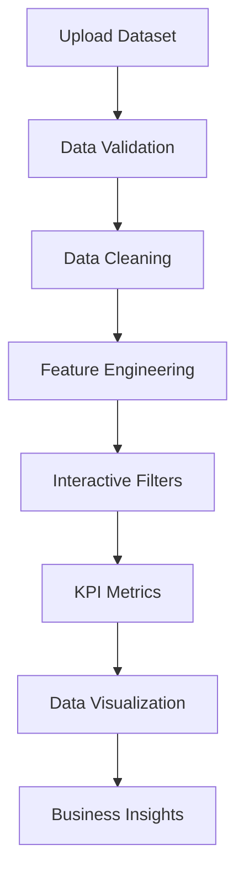

# 📊 Sales Analytics Dashboard (Business Intelligence Project)


An **interactive Business Intelligence Dashboard** built using **Python and Streamlit** that allows users to upload sales data and instantly generate **data analytics, KPIs, visualizations, and business insights**.

This project demonstrates **real-world data analytics workflows**, including **data cleaning, revenue analysis, interactive filtering, and visual dashboard development**.

---

# 🚀 Live Demo

🔗 **Open the Dashboard**

https://futureds01-7dzbumhnxoyp3f3p3vgdif.streamlit.app/

---

# 📌 Project Overview

Modern businesses rely heavily on **data-driven decision making**. Sales data contains valuable insights that help organizations understand customer behavior, revenue trends, and product performance.

This project builds a **fully interactive analytics dashboard** that enables users to:

- Upload sales datasets  
- Perform automated data cleaning  
- Generate key business metrics  
- Visualize revenue patterns  
- Identify top-selling products  
- Analyze sales by country  
- Download filtered datasets  

The goal of this project is to simulate a **real-world business intelligence system** used in **data analytics, retail analytics, and e-commerce platforms**.

---

# 🧠 Data Analytics Pipeline



---

# ⚙️ Technologies Used

| Technology | Purpose |
|------------|--------|
| Python | Core programming language |
| Pandas | Data manipulation and analysis |
| Matplotlib | Data visualization |
| Streamlit | Web dashboard development |
| Jupyter Notebook | Data exploration |

---

# 📊 Dashboard Features

The dashboard provides several **interactive analytics features**.

---

## 📂 1. Dataset Upload

Users can upload a **CSV dataset** directly into the dashboard.

Required dataset columns:

```
InvoiceNo
StockCode
Description
Quantity
InvoiceDate
UnitPrice
CustomerID
Country
```

The dashboard automatically validates the dataset format.

---

# 🧹 2. Data Cleaning

The application performs automated preprocessing:

- Removes missing values  
- Filters invalid quantities  
- Converts date fields  
- Removes corrupted records  

Revenue is calculated using:

```
Revenue = Quantity × UnitPrice
```

---

# 📈 3. Key Performance Indicators (KPIs)

The dashboard displays important business metrics:

- 💰 **Total Revenue**
- 🧾 **Total Orders**
- 👥 **Total Customers**

These metrics provide a **quick overview of business performance**.

---

# 📉 4. Monthly Revenue Trend

A **line chart visualization** shows revenue growth over time.

This helps identify:

- Sales growth  
- Seasonal trends  
- Business cycles  

---

# 🏆 5. Top Products by Revenue

A **horizontal bar chart** displays the **Top 10 revenue-generating products**.

This helps businesses identify:

- Best-selling products  
- High-performing inventory  
- Product demand patterns  

---

# 🌍 6. Revenue by Country

A visualization showing **revenue distribution across countries**.

This insight helps companies understand:

- Market distribution  
- Regional performance  
- Global sales trends  

---

# 🔎 7. Interactive Filters

The dashboard allows users to filter the data using:

- 📅 **Date Range Filter**
- 🌍 **Country Selection**

This enables focused analysis on **specific markets or time periods**.

---

# 📥 8. Export Filtered Data

Users can **download the filtered dataset** directly from the dashboard for further analysis.

---

# 💡 Business Insights

The dashboard helps generate insights such as:

- Revenue seasonality patterns  
- Product performance contribution  
- Market concentration by country  
- Customer purchasing behavior  

These insights support **strategic decision making**.

---

# 📂 Project Structure

```
Sales-Analytics-Dashboard
│
├── app.py
├── sales_dashboard.ipynb
├── task_1.csv
├── requirements.txt
└── README.md
```

---

# 🚀 How to Run the Project

### 1️⃣ Clone the Repository

```bash
git clone https://github.com/your-username/sales-analytics-dashboard.git
```

### 2️⃣ Navigate to Project Directory

```bash
cd sales-analytics-dashboard
```

### 3️⃣ Install Required Libraries

```bash
pip install -r requirements.txt
```

### 4️⃣ Run the Streamlit App

```bash
streamlit run app.py
```

---

# 🎯 Skills Demonstrated

This project highlights the following **Data Science and Analytics skills**:

- Data Cleaning  
- Data Visualization  
- Business Intelligence  
- Dashboard Development  
- Python Programming  
- Exploratory Data Analysis (EDA)  
- Streamlit Deployment  
- Analytical Thinking  

---

# 🌍 Real-World Applications

This type of dashboard is used in:

- E-commerce analytics  
- Retail data analysis  
- Business intelligence systems  
- Sales monitoring platforms  
- Financial analytics  

Companies use such dashboards to **track performance and optimize business strategies**.

---

# 👨‍💻 Author

**Taksh Samirkumar Patel**

Computer Science Engineering Student  
Interested in **Artificial Intelligence | Machine Learning | Data Science**

🔗 LinkedIn  
https://www.linkedin.com/in/taksh-patel-6a6b97325

💻 LeetCode  
https://leetcode.com/u/5EWSbJZA6M/

---

⭐ If you found this project helpful, consider **giving it a star on GitHub!**
